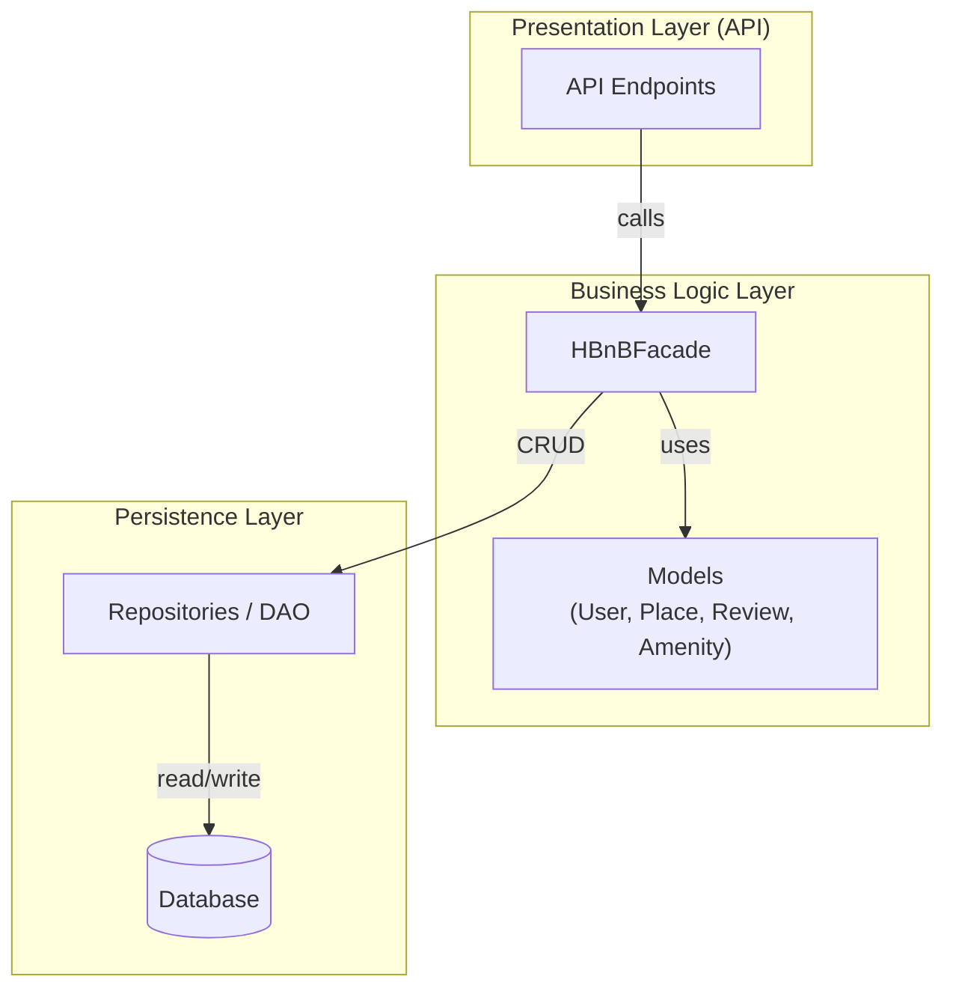
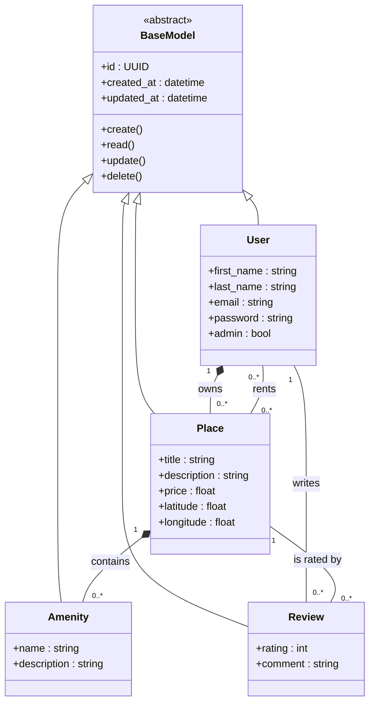
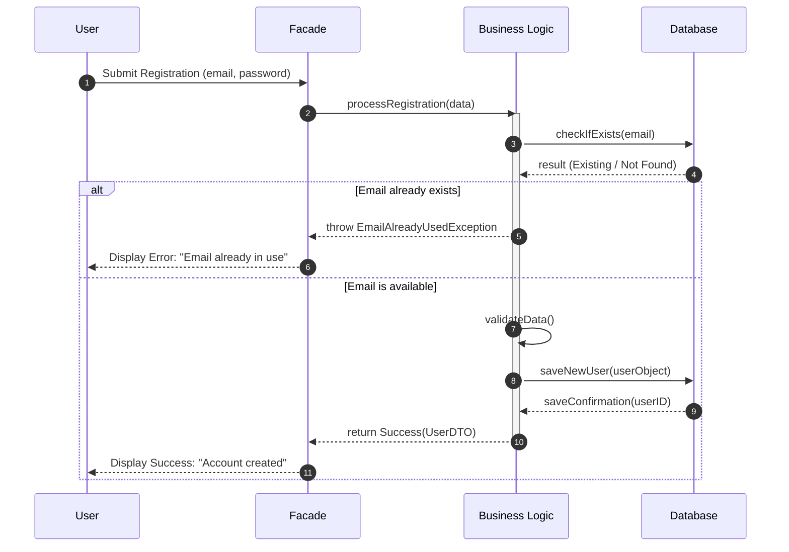
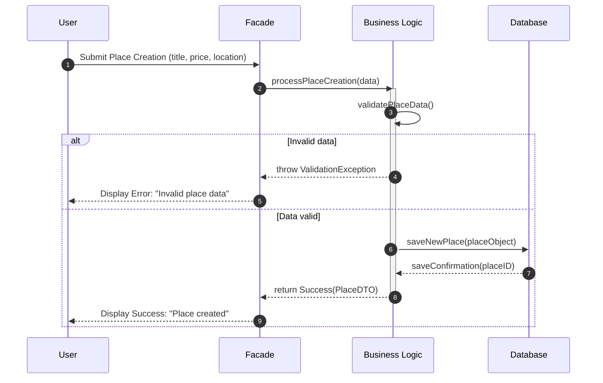
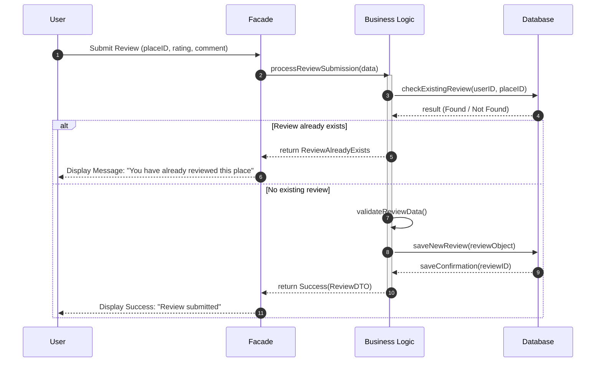
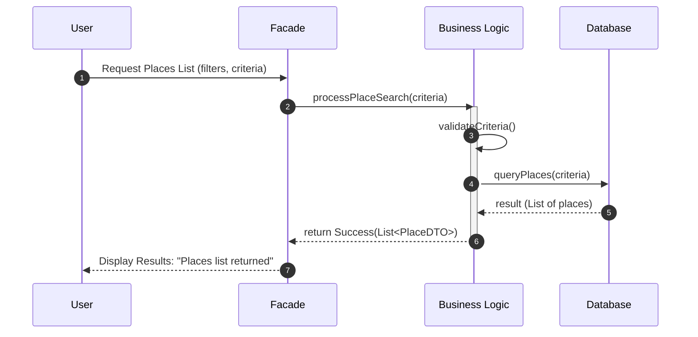

# HBnB Evolution - Technical Documentation

## Table of Contents
1. [Introduction](#introduction)
2. [High-Level Architecture](#high-level-architecture)
3. [Business Logic Layer](#business-logic-layer)
4. [API Sequence Diagrams](#api-sequence-diagrams)

---

## 1. Introduction

HBnB Evolution is a simplified AirBnB-like application that allows users to:
- Register and manage user profiles
- Create and manage property listings (places)
- Leave reviews for places
- Search for available places with filters

### Main Entities
- **User**: Represents registered users (first_name, last_name, email, password, admin status)
- **Place**: Property listings (title, description, price, latitude, longitude)
- **Review**: User feedback on places (rating, comment)
- **Amenity**: Property features (name, description)

### Architecture
The application uses a **3-layer architecture**:
- **Presentation Layer** (API): Handles user requests and responses
- **Business Logic Layer**: Contains models and business rules
- **Persistence Layer**: Manages data storage and retrieval

---

## 2. High-Level Architecture

The application follows the **Facade Pattern** to simplify communication between layers.

**Layer Responsibilities:**
- **Presentation Layer**: Receives HTTP requests, returns JSON responses
- **Business Logic Layer**: Validates data, enforces business rules, manages models
- **Persistence Layer**: Handles database operations (CRUD)

---

## 3. Business Logic Layer

### Class Diagram

### Entity Descriptions

**BaseModel** (abstract):
- `id`: Unique identifier (UUID)
- `created_at`, `updated_at`: Audit timestamps
- Common CRUD methods

**User**:
- Attributes: first_name, last_name, email (unique), password (encrypted), admin flag
- Can own multiple places, write multiple reviews

**Place**:
- Attributes: title, description, price, latitude, longitude
- Belongs to one user (owner)
- Contains multiple amenities, receives multiple reviews

**Review**:
- Attributes: rating (1-5), comment
- Linked to one user and one place
- Business rule: One review per user per place

**Amenity**:
- Attributes: name (unique), description
- Can be associated with multiple places

---

## 4. API Sequence Diagrams

### 4.1 User Registration

**Flow**: User submits registration form → System checks if email exists → If available, validates data and creates user account.

**Business Rules**: Email must be unique, password must be encrypted before storage.

---

### 4.2 Place Creation

**Flow**: User submits place details → System validates data (price, coordinates, etc.) → If valid, creates place and links to owner.

**Business Rules**: Price must be positive, coordinates must be valid, user must be authenticated.

---

### 4.3 Review Submission

**Flow**: User submits review → System checks if user already reviewed this place → If not, validates and saves review.

**Business Rules**: One review per user per place, rating must be 1-5, user cannot review their own place.

---

### 4.4 Fetching Places List

**Flow**: User requests places with filters → System validates criteria → Queries database and returns matching places.

**Business Rules**: Filters must be valid (price range, coordinates, etc.), results can be paginated.

---

## 5. Conclusion

### Summary
This documentation provides the architectural foundation for the HBnB Evolution application, covering:
- Three-layer architecture with Facade pattern
- Entity relationships and business rules
- API interaction flows for core operations

### Key Components
- **Entities**: User, Place, Review, Amenity (all inherit from BaseModel)
- **Relationships**: Composition (User-Place), Association (User-Review, Place-Review)
- **Communication**: Unidirectional flow through layers (API → Facade → Repository → Database)

---

**Document Version**: 1.0  
**Last Updated**: February 12, 2026
**Author**: Florian ROOSEBEKE, Tom VIEILLEDENT

