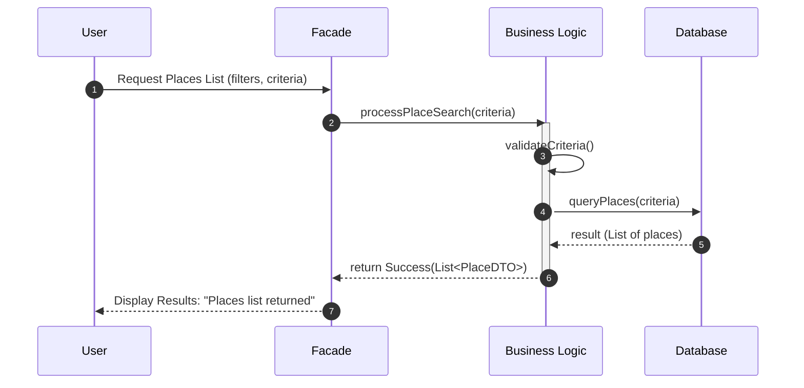

```mermaid
sequenceDiagram
    autonumber
    participant U as User
    participant F as Facade
    participant BL as Business Logic
    participant DB as Database

    U->>F: Request Places List (filters, criteria)

    F->>BL: processPlaceSearch(criteria)
    activate BL

    BL->>BL: validateCriteria()
    BL->>DB: queryPlaces(criteria)
    DB-->>BL: result (List of places)

    BL-->>F: return Success(List<PlaceDTO>)
    deactivate BL
    F-->>U: Display Results: "Places list returned"
```
