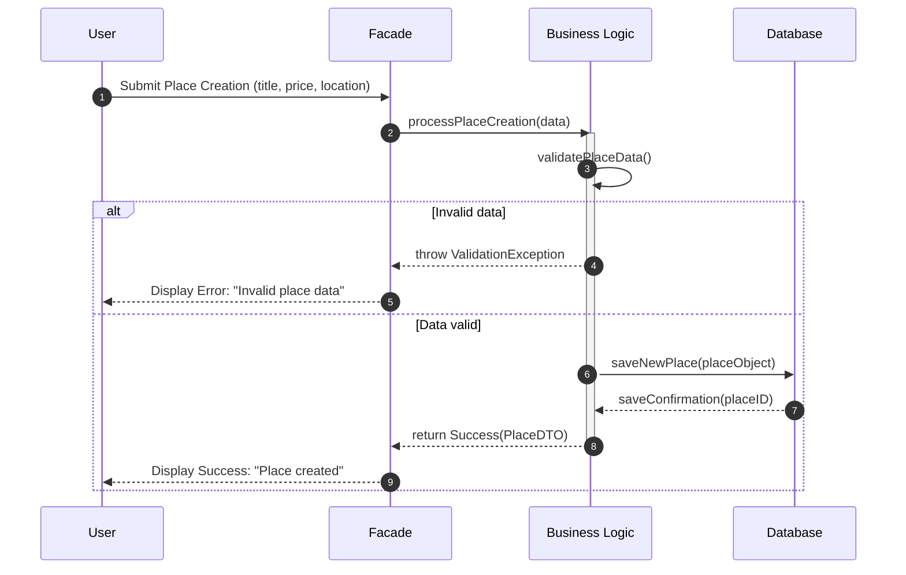

```mermaid
sequenceDiagram
    autonumber
    participant U as User
    participant F as Facade
    participant BL as Business Logic
    participant DB as Database

    U->>F: Submit Place Creation (title, price, location)

    F->>BL: processPlaceCreation(data)
    activate BL

    BL->>BL: validatePlaceData()

    alt Invalid data
        BL-->>F: throw ValidationException
        F-->>U: Display Error: "Invalid place data"
    else Data valid
        BL->>DB: saveNewPlace(placeObject)
        DB-->>BL: saveConfirmation(placeID)
        BL-->>F: return Success(PlaceDTO)
        deactivate BL
        F-->>U: Display Success: "Place created"
    end
```