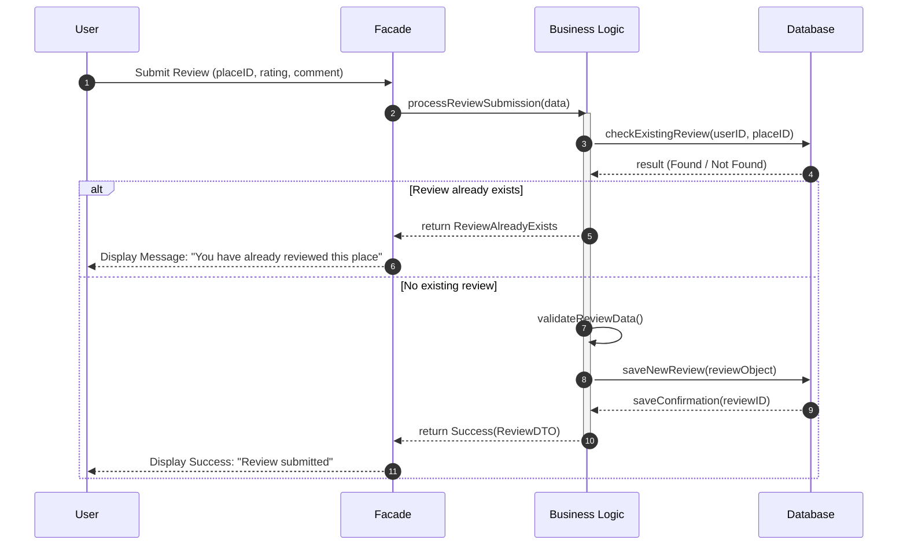

```mermaid
sequenceDiagram
    autonumber
    participant U as User
    participant F as Facade
    participant BL as Business Logic
    participant DB as Database

    U->>F: Submit Review (placeID, rating, comment)

    F->>BL: processReviewSubmission(data)
    activate BL

    BL->>DB: checkExistingReview(userID, placeID)
    DB-->>BL: result (Found / Not Found)

    alt Review already exists
        BL-->>F: return ReviewAlreadyExists
        F-->>U: Display Message: "You have already reviewed this place"
    else No existing review
        BL->>BL: validateReviewData()
        BL->>DB: saveNewReview(reviewObject)
        DB-->>BL: saveConfirmation(reviewID)
        BL-->>F: return Success(ReviewDTO)
        deactivate BL
        F-->>U: Display Success: "Review submitted"
    end
```
