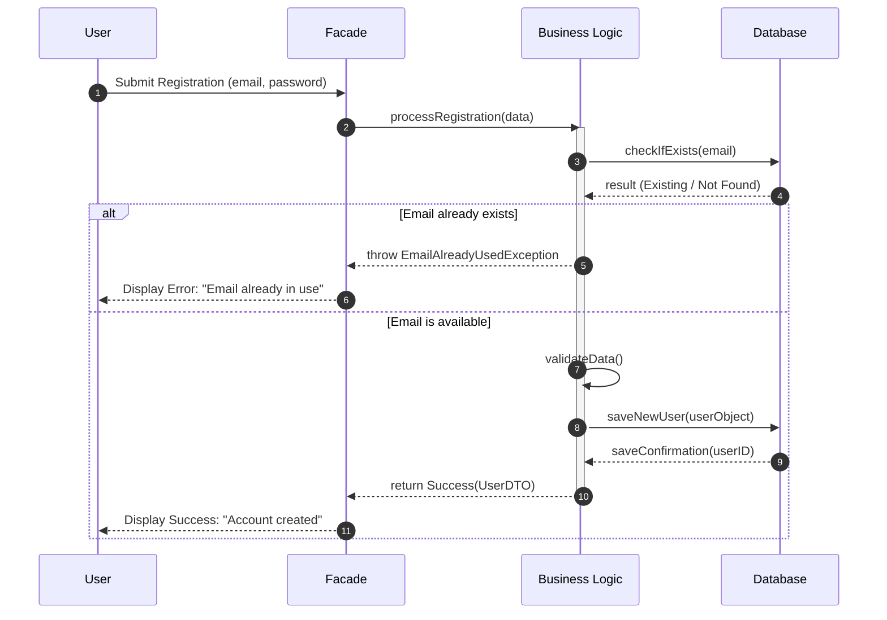

```mermaid
sequenceDiagram
    autonumber
    participant U as User
    participant F as Facade
    participant BL as Business Logic
    participant DB as Database

    U->>F: Submit Registration (email, password)
    
    F->>BL: processRegistration(data)
    activate BL
    
    BL->>DB: checkIfExists(email)
    DB-->>BL: result (Existing / Not Found)

    alt Email already exists
        BL-->>F: throw EmailAlreadyUsedException
        F-->>U: Display Error: "Email already in use"
    else Email is available
        BL->>BL: validateData()
        BL->>DB: saveNewUser(userObject)
        DB-->>BL: saveConfirmation(userID)
        BL-->>F: return Success(UserDTO)
        deactivate BL
        F-->>U: Display Success: "Account created"
    end
```
    