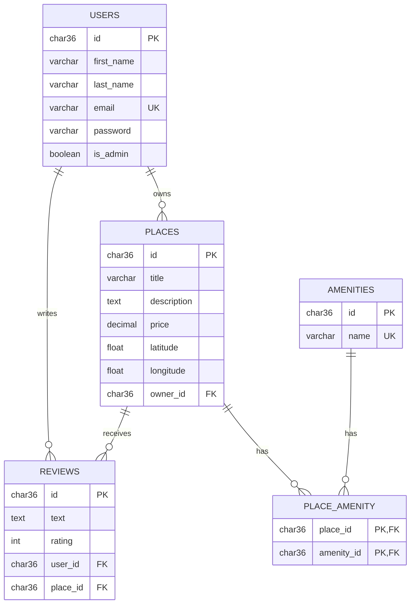
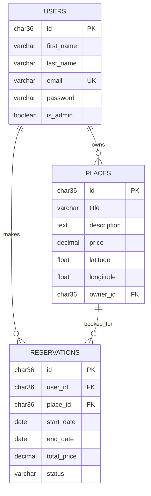

# HBnB - ER Diagrams (Mermaid)

This file contains the database ER diagrams for the HBnB Part 3 schema.

## 1. Core Database Schema

## 2. Extension Example - Reservation

## Export (PNG/SVG)

1. Open https://mermaid-js.github.io/mermaid-live-editor/
2. Paste one diagram block.
3. Check the render.
4. Export as PNG or SVG.
