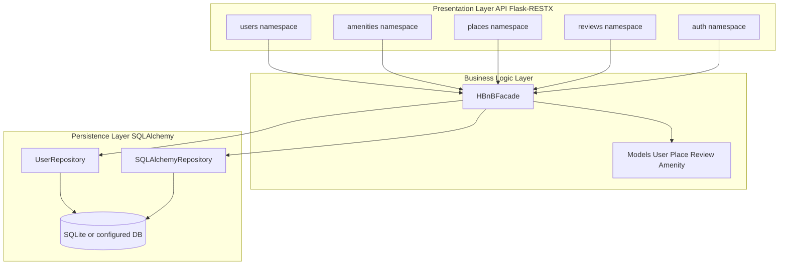
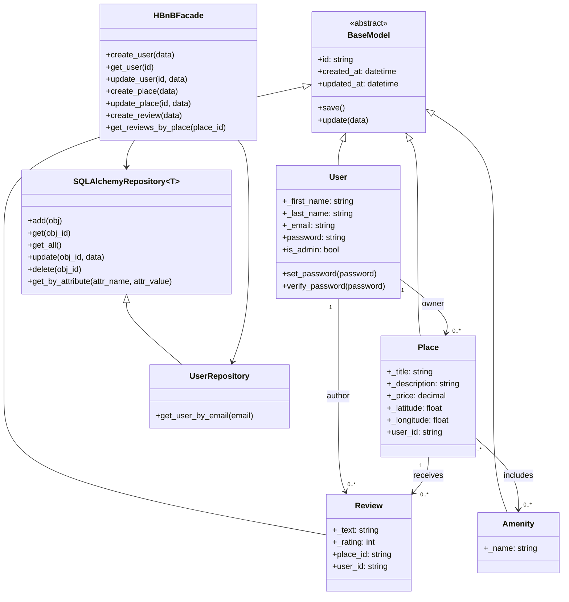
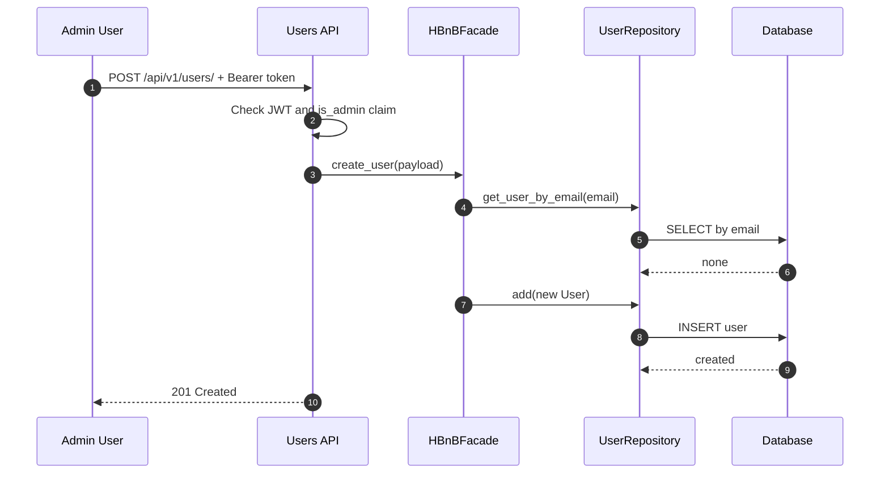
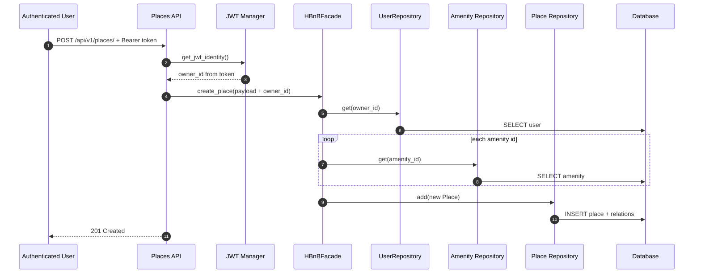
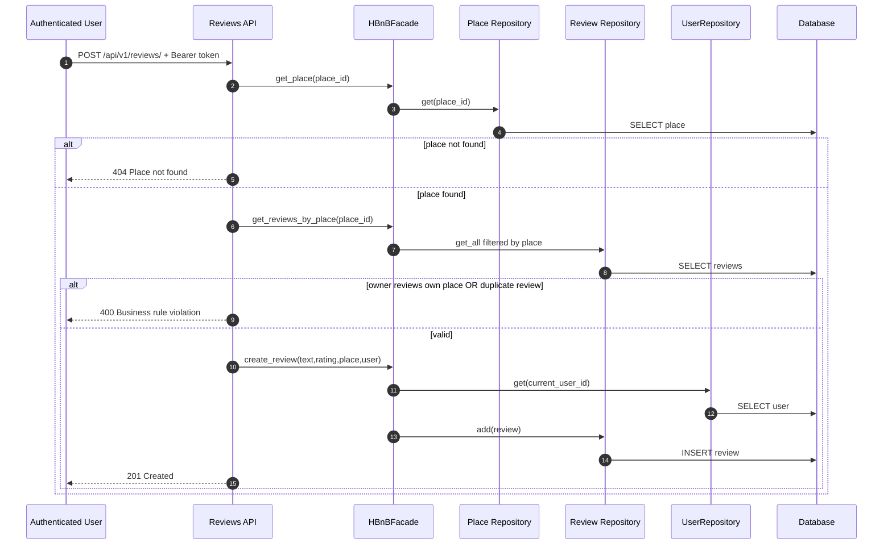
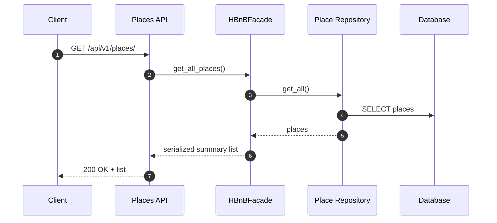

# HBnB - Part 3

REST API for the HBnB platform with JWT Bearer authentication, Swagger/OpenAPI,
layered architecture, and automated test coverage using pytest.

## Table of Contents

- [1. Objective](#1-objective)
- [2. Tech Stack](#2-tech-stack)
- [3. Project Architecture](#3-project-architecture)
- [4. Technical Documentation](#4-technical-documentation)
- [5. Mermaid Diagrams](#5-mermaid-diagrams)
- [6. Installation](#6-installation)
- [7. Run the Application](#7-run-the-application)
- [8. Swagger and Authentication](#8-swagger-and-authentication)
- [9. API Endpoints](#9-api-endpoints)
- [10. Business Rules and Validation](#10-business-rules-and-validation)
- [11. cURL Examples](#11-curl-examples)
- [12. Tests](#12-tests)
- [13. Semantic Test Catalog](#13-semantic-test-catalog)
- [14. Authors](#14-authors)

## 1. Objective

Part 3 provides a secure and production-style API to manage:

- users,
- amenities,
- places,
- reviews,

with strict business validation, role-based permissions (admin/user),
and JWT authentication integrated with Swagger.

## 2. Tech Stack

- Python 3
- Flask
- Flask-RESTX (routing + Swagger)
- Flask-SQLAlchemy
- Flask-Bcrypt
- Flask-JWT-Extended
- email-validator
- pytest / pytest-cov

## 3. Project Architecture

```text
hbnb/
├── app/
│   ├── api/v1/              # REST endpoints (auth, users, amenities, places, reviews)
│   ├── models/              # Domain entities + validations
│   ├── persistence/         # SQLAlchemy repositories
│   └── services/            # Facade (business logic)
├── config.py
├── run.py
├── requirements.txt
├── pytest.ini
└── tests/
    ├── conftest.py
    ├── helpers.py
    ├── test_auth.py
    ├── test_users.py
    ├── test_amenities.py
    ├── test_places.py
    └── test_reviews.py
```

Processing flow:

`API Route -> Facade -> Repository -> SQLAlchemy/DB`

## 4. Technical Documentation

### 4.1 Three-layer architecture

- Presentation: Flask-RESTX endpoints, JSON serialization, HTTP status handling.
- Business: facade + models, business rule enforcement.
- Persistence: SQLAlchemy repositories and database transactions.

### 4.2 Facade pattern

`HBnBFacade` centralizes business operations:

- Users: create/get/update/list + email lookup
- Amenities: create/get/update/delete/list
- Places: create/get/update/delete/list + owner/amenity resolution
- Reviews: create/get/update/delete/list + place filtering

### 4.3 Entities and relationships

- BaseModel: id, created_at, updated_at
- User: first_name, last_name, unique email, hashed password, is_admin
- Place: title, description, price, latitude, longitude, owner
- Amenity: name
- Review: text, rating, user, place

Main relationships:

- User 1..n Place
- User 1..n Review
- Place 1..n Review
- Place n..n Amenity

### 4.4 Key business rules

- JWT is required on protected routes.
- Admin role is required to:
  - create users through API,
  - create/update/delete amenities.
- Non-admin users can only modify authorized own resources.
- `PUT /users/<id>` for non-admin: email/password/is_admin are forbidden.
- `POST /reviews`: users cannot review their own place.
- `POST /reviews`: only one review per user per place.

## 5. Mermaid Diagrams

### 5.1 High-level architecture



### 5.2 Class diagram



### 5.3 Sequence - User creation (admin)



### 5.4 Sequence - Place creation



### 5.5 Sequence - Review submission



### 5.6 Sequence - Place list retrieval



## 6. Installation

From the `hbnb` directory:

```bash
python3 -m venv .venv
source .venv/bin/activate
pip install -r requirements.txt
pip install pytest pytest-cov
```

## 7. Run the Application

```bash
source .venv/bin/activate
python3 run.py
```

Default URLs:

- API: http://127.0.0.1:5000/api/v1
- Swagger UI: http://127.0.0.1:5000/

## 8. Swagger and Authentication

Required header for protected routes:

`Authorization: Bearer <token>`

### Create or promote an admin account

```bash
source .venv/bin/activate
python3 - <<'PY'
from app import create_app, db
from app.services import facade

app = create_app()

with app.app_context():
    email = "admin@example.com"
    user = facade.get_user_by_email(email)

    if user:
        user.is_admin = True
        db.session.commit()
        print("Utilisateur existant promu admin:", email)
    else:
        user = facade.create_user({
            "first_name": "Super",
            "last_name": "Admin",
            "email": email,
            "password": "admin",
            "is_admin": True
        })
        print("Admin cree:", user.id, email)
PY
```

### Admin login

```bash
curl -X POST http://127.0.0.1:5000/api/v1/auth/login \
  -H "Content-Type: application/json" \
  -d '{"email":"admin@example.com","password":"admin"}'
```

Expected response:

```json
{
  "access_token": "<jwt_token>"
}
```

In Swagger, click Authorize and enter exactly:

`Bearer <token>`

## 9. API Endpoints

Base URL: http://127.0.0.1:5000/api/v1

### Auth

- POST /auth/login
- GET /auth/protected

### Users

- POST /users/ (admin only)
- GET /users/ (public)
- GET /users/<user_id> (public)
- PUT /users/<user_id> (owner or admin)

### Amenities

- POST /amenities/ (admin only)
- GET /amenities/ (public)
- GET /amenities/<amenity_id> (public)
- PUT /amenities/<amenity_id> (admin only)
- DELETE /amenities/<amenity_id> (admin only)

### Places

- POST /places/ (authenticated)
- GET /places/ (public)
- GET /places/<place_id> (public)
- PUT /places/<place_id> (owner or admin)
- DELETE /places/<place_id> (owner or admin)
- GET /places/<place_id>/reviews (public)

### Reviews

- POST /reviews/ (authenticated)
- GET /reviews/ (public)
- GET /reviews/<review_id> (public)
- PUT /reviews/<review_id> (owner or admin)
- DELETE /reviews/<review_id> (owner or admin)

## 10. Business Rules and Validation

### User

- first_name: non-empty string, max length 50
- last_name: non-empty string, max length 50
- email: valid format and unique
- password: stored as hash

### Amenity

- name: non-empty string, max length 50

### Place

- title: non-empty string, max length 100
- description: non-empty string, max length 2000
- price: strictly positive number
- latitude: range [-90, 90]
- longitude: range [-180, 180]
- owner_id: derived from JWT identity (not from client payload)
- amenities: existing IDs only

### Review

- text: string (max length 2000)
- rating: integer in range [1, 5]
- place_id: must exist
- users cannot review their own place
- one review per user per place

## 11. cURL Examples

### Admin login

```bash
curl -X POST http://127.0.0.1:5000/api/v1/auth/login \
  -H "Content-Type: application/json" \
  -d '{"email":"admin@example.com","password":"admin"}'
```

### Create amenity (admin)

```bash
curl -X POST http://127.0.0.1:5000/api/v1/amenities/ \
  -H "Content-Type: application/json" \
  -H "Authorization: Bearer <token>" \
  -d '{"name":"WiFi"}'
```

### Create place (authenticated user)

```bash
curl -X POST http://127.0.0.1:5000/api/v1/places/ \
  -H "Content-Type: application/json" \
  -H "Authorization: Bearer <token>" \
  -d '{
    "title":"Studio center",
    "description":"Quiet and bright",
    "price":79.9,
    "latitude":48.8566,
    "longitude":2.3522,
    "amenities":[]
  }'
```

### Create review

```bash
curl -X POST http://127.0.0.1:5000/api/v1/reviews/ \
  -H "Content-Type: application/json" \
  -H "Authorization: Bearer <token>" \
  -d '{"text":"Great stay","rating":5,"place_id":"<PLACE_ID>"}'
```

## 12. Tests

From the `hbnb` directory:

```bash
source .venv/bin/activate
pytest
```

Useful commands:

```bash
pytest -v -rA
pytest -q -rA
pytest tests/test_auth.py
pytest --cov=app --cov-report=term-missing
```

## 13. Semantic Test Catalog

Each line describes a test expected to pass during a standard `pytest` run.

### Auth (4 tests)

- Valid login returns a JWT token.
- Invalid login credentials return 401.
- Protected route without token returns 401.
- Protected route with valid token returns 200.

### Users (9 tests)

- Public users list returns 200.
- User creation without auth returns 401.
- User creation by non-admin returns 403.
- User creation by admin returns 201.
- User creation with invalid payload returns 400.
- Unknown user retrieval returns 404.
- Non-admin update of another user returns 403.
- Non-admin email change attempt returns 400.
- Admin user update returns 200.

### Amenities (10 tests)

- Public amenities list returns 200.
- Amenity creation without auth returns 401.
- Amenity creation by non-admin returns 403.
- Amenity creation by admin returns 201.
- Invalid amenity creation returns 400.
- Unknown amenity retrieval returns 404.
- Amenity update by admin returns 200.
- Amenity update by non-admin returns 403.
- Amenity delete by admin returns 200.
- Unknown amenity delete returns 404.

### Places (10 tests)

- Public places list returns 200.
- Place creation without auth returns 401.
- Place creation by authenticated user returns 201.
- Invalid place creation returns 400.
- Unknown place retrieval returns 404.
- Place update by non-owner returns 403.
- Place update by owner returns 200.
- Place delete by non-owner returns 403.
- Place delete by owner returns 200.
- Review list for unknown place returns 404.

### Reviews (9 tests)

- Public reviews list returns 200.
- Review creation without auth returns 401.
- Review creation with invalid payload returns 400.
- Review creation on unknown place returns 404.
- Owner cannot review own place returns 400.
- Valid user review creation returns 201.
- Review update by non-owner returns 403.
- Review delete by owner returns 200.
- Unknown review retrieval returns 404.

Total: 42 tests.

## 14. Authors

Florian Roosebeke
Tom Vieilledent
